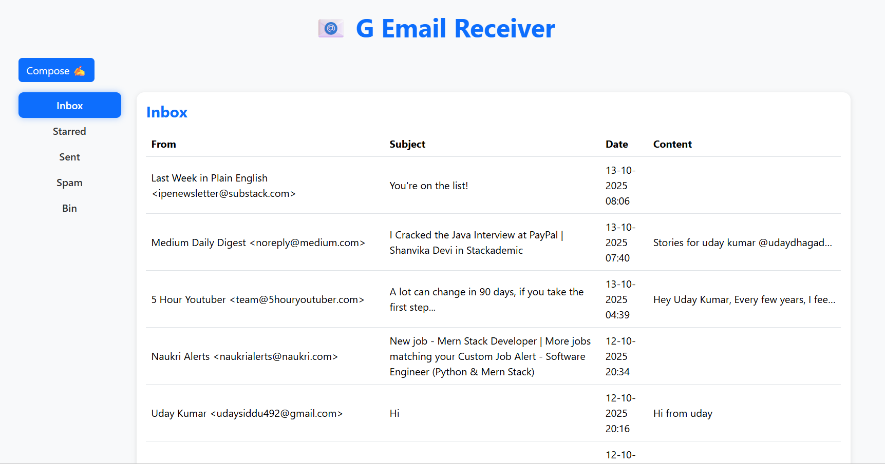

# 📥 GMailReceiver Service

**GMailReceiver** is a Spring Boot application that displays emails in a user-friendly inbox UI and integrates seamlessly with GMailSender to send emails. It allows users to view, compose, and manage emails with ease. The service provides a clean and responsive interface for email operations.

---

## 🛠️ Technology Stack

- Java 17+
- Spring Boot 3.x
- Spring Web, Spring MVC
- Thymeleaf (UI templates)
- RestTemplate (for calling GMailSender service)
- Bootstrap 5 (frontend styling)
- Maven

---

## 🔹 Features

- Display received emails in Inbox, Starred, Sent, Spam, and Bin folders.
- Compose and send emails via GMailSender REST API.
- Show success/error messages after sending emails.
- Back to Inbox button after sending emails.
- Responsive UI with table and modal forms for email operations.

---
## 📸 Screenshots
### Compose Mail


## ⚙️ Configuration

Update `src/main/resources/application.properties` with your settings:

```properties
spring.application.name=GEmailReceiver

# Gmail IMAP settings (for reading emails)
spring.mail.host=imap.gmail.com
spring.mail.port=993
spring.mail.username=your-email@gmail.com
spring.mail.password=your-app-password

# GMailSender service URL
gmailsender.url=http://localhost:8081
```

# 📧 How Email Works Internally — SMTP, IMAP & POP3 Explained

Emails may look simple on the surface, but under the hood, there’s a robust system of **protocols** that move messages reliably across the internet.  
This document explains how sending and receiving emails actually works — from the sender’s outbox to the receiver’s inbox.

---

## 🧭 Overview

When you send or receive an email, several servers and protocols come into play:

- **SMTP (Simple Mail Transfer Protocol)** → handles **sending** emails.
- **IMAP (Internet Message Access Protocol)** → handles **retrieving** emails (keeps mail synced across devices).
- **POP3 (Post Office Protocol v3)** → also retrieves emails, but **downloads and usually removes** them from the server.

These protocols are layered on top of **TCP/IP**, and they use well-defined ports and security standards (like SSL/TLS).

---

## 🚀 Sending an Email (SMTP)

**SMTP** is the workhorse for sending emails.  
It’s used by your mail client (like Gmail, Outlook, or Thunderbird) to deliver messages to the mail server — and by mail servers themselves to relay messages between domains.

### SMTP Flow:

1. **User writes an email** in a client (MUA — Mail User Agent).
2. The MUA connects to an **SMTP server** (MSA — Mail Submission Agent) using:
    - Port **587** (with STARTTLS) or **465** (with SSL/TLS).
3. The MSA validates the user and **forwards the email** to the **Mail Transfer Agent (MTA)**.
4. The MTA looks up the recipient’s domain via **DNS MX (Mail Exchange) records**.
5. The email is routed across the internet, possibly hopping through multiple MTAs.
6. Finally, the recipient’s **Mail Delivery Agent (MDA)** stores the email in their mailbox on the destination mail server.

**In short:**

## Sender (MUA) → MSA → MTA → MDA → Recipient’s Mailbox


---

## 📥 Receiving Emails (IMAP vs POP3)

Once the email reaches the recipient’s mail server, the user can fetch it using either **IMAP** or **POP3**.

### 🔄 IMAP (Internet Message Access Protocol)

IMAP keeps your emails **on the server** and **synchronizes** changes (read/unread, folders, flags) across multiple devices.

- **Default ports:**
    - `143` (IMAP)
    - `993` (IMAPS - IMAP over SSL)
- Best for multi-device users — mobile, laptop, webmail, etc.

**Flow:**

## Mail Server → IMAP Server → Client (syncs messages)


When you open an email on your phone, it’s not downloaded — you’re viewing it remotely.  
Delete or move it, and the change reflects everywhere.

---

### ⬇️ POP3 (Post Office Protocol v3)

POP3 is older and simpler — it **downloads** emails from the server and (by default) **removes** them afterward.

- **Default ports:**
    - `110` (POP3)
    - `995` (POP3S - over SSL)
- Great for single-device setups, less ideal for modern multi-device use.

**Flow:**
## Mail Server → POP3 Server → Client (downloads and optionally deletes)


Some clients can be configured to “leave a copy on the server,” but that’s a workaround — IMAP handles this natively.

---

## 🔐 Security and Authentication

Modern email systems always wrap these protocols in encryption:

| Protocol | Default Port | Secure Port (SSL/TLS) |
|-----------|---------------|-----------------------|
| SMTP      | 25 / 587      | 465                  |
| IMAP      | 143           | 993                  |
| POP3      | 110           | 995                  |

Authentication uses either:
- **LOGIN / PLAIN** (basic, often over TLS)
- **OAuth 2.0** (modern, token-based — used by Gmail, Outlook, etc.)

---

## 📡 Real-World Example

Let’s say **Alice** sends an email to **Bob**:

1. Alice’s mail client connects to `smtp.gmail.com:587`.
2. Gmail’s MTA looks up Bob’s domain’s MX record — say `mx.outlook.com`.
3. Gmail’s server sends the message to Outlook’s mail server.
4. Outlook stores it in Bob’s mailbox.
5. Bob’s phone connects to `imap.outlook.com:993` and retrieves/syncs the email.


---

> “Email’s been around since the ‘70s — the tech is old, but it’s rock-solid once you understand the moving parts.”

---


## 📜 License
This project is licensed under the MIT License.


